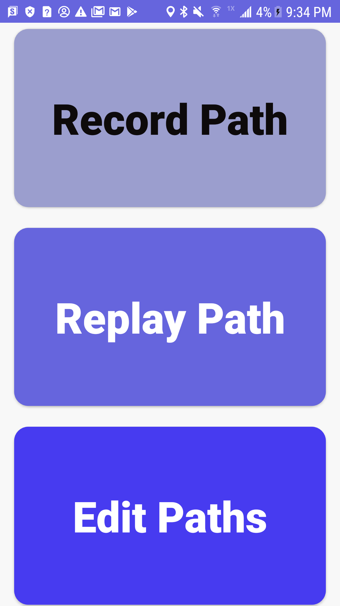
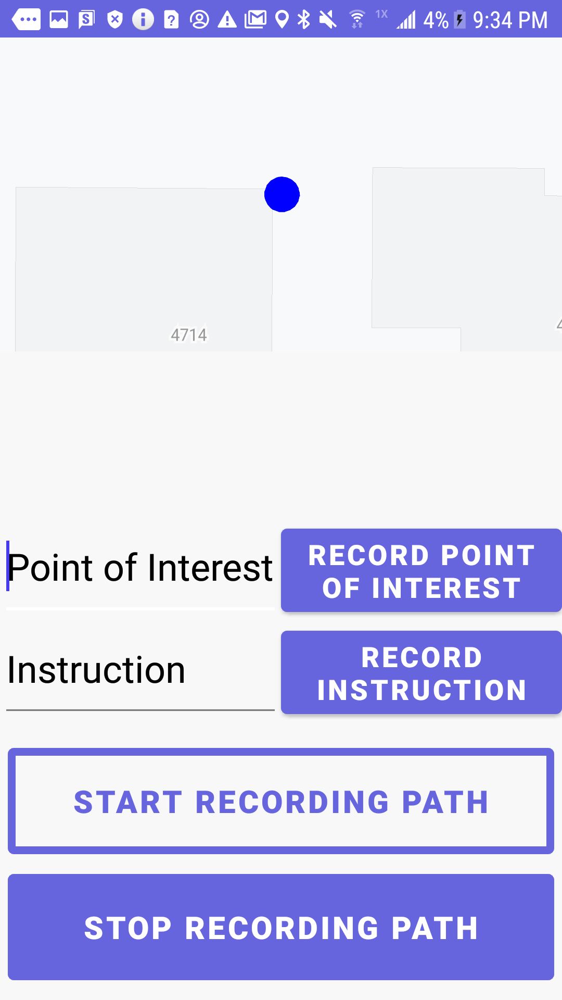
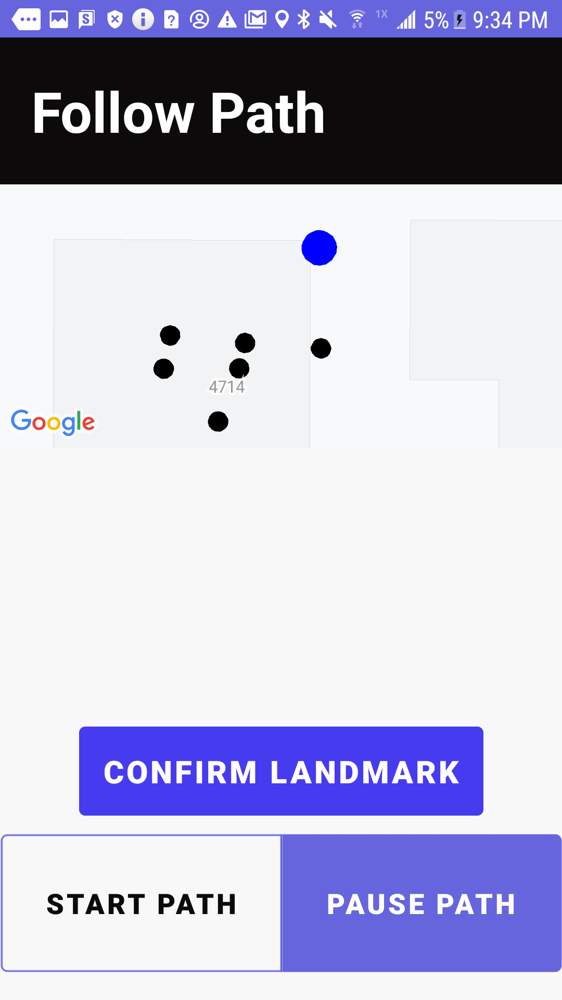
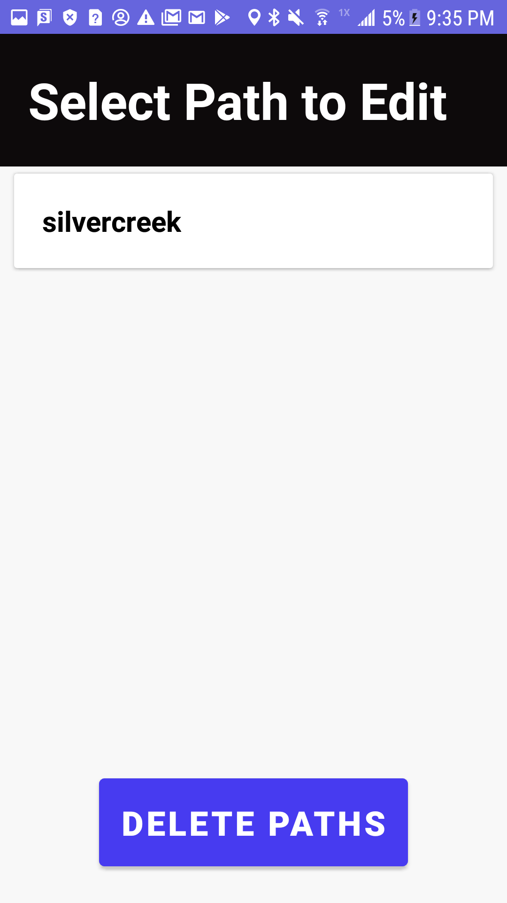

# NaviBuzz
| [Screenshots](#screenshots) | [Abstract](#abstract) | [User Manual](#user-manual) | [Download](#download)
| --------------- | -------- | ----------- | --------- |
### Participants
* **Developer**: Omar Ibrahim - _UW CSE_
* **Developer**: Dylan Burton - _UW CSE_
* **Developer**: Allyson Ely - _UW CSE_
* **Needs Expert**: David Miller - _Seattle Transit_

## Screenshots

  
    
  

  

  

## Abstract
Our overall goal this quarter was to create an audio based navigation tool for visually-impaired transit users that could extend to places with poor internet connectivity. This project is in collaboration with Seattle Sound Transit and individuals with visual impairment disabilities in the surrounding community. Navigating a new environment can be a challenge with a disability, and currently Seattle Transit employs O&M guides to aid disabled transit users in learning a path through transit stations. After learning about the current processes for supporting visually-impaired transit users with O&M guides in Seattle Transit, we decided to build NaviBuzz to be a tool for recording and renavigating personalized paths through indoor environments. NaviBuzz is a navigation system with audio assistance which allows users to work with O&M Guides to record a path through a transit station in the time that the O&M Guide would be training them on that path. Users then have the ability to use the navigation system to retrace that path. This enables users to safely and repeatedly navigate throughout indoor transit environments, as well as reinforcing independent navigation skills for the user. We’d eventually like to be able to use recorded path data to augment GTFS path data within these stations.

### Project Goals
1. Paths travleed are very specific to the person so the tool should provide customizable paths
    - Allow different landmarks or locations in a station for a user to verify.  
    - They have different preferences for metrics ( feet/ meters/steps)  
2. Allow users to have easy access to path training from O&M guides without having to have O&M guides present
3. Navigation assitance for indoor/underground environments
4. Have accessible features to aid with different levels of visual impairment and for use with TalkBack

## Development Plan
We chose to build this tool as an Android application, as that was the option that felt best suited to both our needs for this tool and our software development skills. We divided the development work into three independent areas that we could each work on individually; the UI, database model, and backend navigation system. We then worked collaboratively to integrate these parts into one complete application. For the navigation system, we chose to use the [NaviSens API](https://www.navisens.com/) to enable navigation (mostly) without the use of GPS. We chose this API as one of our project goals was to create a navigation system that could work well in indoor and underground transit environments, places where GPS connection may be inaccurate or nonexistent. We also used the [Android Speech API](https://developer.android.com/reference/android/speech/package-summary) for communicating auditory information to our users.

We researched existing solutions, but most existing tools either: 
- only work outdoors
- are only available on certain platforms/with certain physical devices/are very expensive
- do not support independent navigation
- are deprecated or gone altogether. 

With this in mind, we determined the high level tasks for our tool to be:
- Get the current location
- Training a Station path for a user (with an OM guide, for example)
- Follow a pre trained personal path 

We also wanted to work on collecting user-saved path data to build a dataset of information that could be used in the future to construct or augment GTFS Pathway data, although this is something we were not able to accomplish within the scope of this project.

### Storyboards

  
    
  

  

  

### Constraints/Limitations
- GPS retrieval has a margin of error
- Didn’t have the ability to go through the O&M training process
- We weren’t able to test within an transit station
- We weren’t able to test with our target user-group (visually impaired transit users)
- Navisens has margins of error

## Experimental Results
We had 3 test users run preliminary experiments with our application (note that none of our test users were visually impaired, however, our timeline and resources for testing were severely limited). We gave users the current version of the app, and asked them to perform a set of tasks; record a path using the application, then attempt to renavigate that path using the application. They could also optionally edit the path they recorded. Based on the feedback we received from this testing, we made the following changes:

Fixes:
- Changed “landmark” to “point of interest” and changed “stop path” to “pause path”
- Path deletion from database
- Fixed some crashes within path recording activity (there is still a ZipException that occasionally occurs when starting up Navisens, unsure the cause)
- Fix some orientation instruction inacurracies

Features:
- Add “walk straight” instruction if degrees < 10 left/right
- Add a new point upon creation of landmark/instruction instead of associating it with the last point. 
- Added map on the replay screen for those with limited vision
- Added an edit path screen to change landmark/instruction text and delete path

We also included future project expansion ideas in the conclusion section below.

### Bug List
- App seems to time out during RecordPathActivity if it runs too long
- ~After RecordPathActivity crashes, upon openeing it again hitting "Start Path" button will crash (probably because it shouldn't be enabled yet)~
- ~"Confirm Landmark" button on replay path screen does nothing~ 
- Waypoint list on ReplayPathActivity should delete cards once user has passed their points)
- ~"Stop Path" currently only capable of fully stoping path, would be useful to be able to pause~
- ~using a duplicate path name for a new path fully crashes the app, should be an error message~
- ~path name gets saved even if user never records path~
- ~deleting a single path from the database does not work~
- ~setting landmark/instruction should create a point at that location, not assign them to the next/last point, gets innacurate with non-straight path lines~
- Audio navigation involving orientation will give odd degree directions when walking at a moderate pace (I think voice instructions get added to the queue and it takes a while to catch up)
- Audio navigation can give odd directions, unsure if it's related to the previous point. Needs more testing/refining
- Occasionally when I start recording a path my heading is inaccurate. I'm unsure whether this is a hardware/Navisens/or code issue.
- Crashing ZipException issue happens occasionally upon starting Navisens. Unsure the cause
- Add ability to edit path name

## Conclusion
This is a protoype that we completed in over 10 weeks. We developed a prototype where we received feedback and incorporated some ideas into the application. With more time and resources we would expand on this project in the following ways:
- Customizable color schemes
- Customizable metrics, ie. number of steps based on step length, feet, frequency of path points
- Customizable feature to confirm a landmark
- Smoothing of path data when walking straight so that there are fewer instructions
- Allow path to replay properly if a phone is in someone's pocket (calculate orientation from change in location instead of the direction the phone is facing)
- Work with Navisens to record data for multiple levels 
- Lidar sensor integration
- Save path data to a cloud rather than just locally

## User Manual

### Downloading the APK
- If on your mobile device already, download the APK by navigating to the download section on this file to install the APK. Note: You may need to navigate into security settings and allow installation from Unknown sources, see this article for more details: [APK guide](https://www.lifewire.com/install-apk-on-android-4177185)
- If not on your mobile device, enable USB debugging and follow the instructions on the above article [APK guide](https://www.lifewire.com/install-apk-on-android-4177185)

### Requirements
- At least Android 5.0 21 API SDK version (Lollipop) or greater
- Android Studio
- An Android phone with GPS enabled to load the app onto

### Running the App
#### Record a Path
1. Select the “Record Path” option
2. Enter a unique path name
3. Move to a location where you wish to start your path each time
4. Select “Start Recording Path”	
5. Walk along the path you wish to follow
6. If you reach a point of interest you would like to confirm while navigating enter a “Point of Interest”
7. If you have a specific instruction about the physical space enter a “Instruction”

#### Replay a Path
1. Move to the location where you regularly start
2. Select “Replay Path”
3. Select the path you would like to follow
4. Follow the audio instructions
5 If there is a landmark ensure that you are at that landmark and select “Confirm Landmark”
6. When you are done select “Stop Path”

#### Edit a Path
1. Select “Edit Path”
2. Select the path of interest
3. Update the text of any points of interest or instructions
4. Select “Confirm Path” 
5. Select “Confirm”

### Modifying the source code
- Clone the repository
- Open the Android project located in the Team-Navibuzz folder in Android Studio
- Gradle should sync all the dependencies required for this project

## Download
1. Navigate to the releases section of this repository: [NaviBuzz-Releases](https://github.com/CSE482Winter2021/Team-NaviBuzz/releases)
2. Click assets and download the apk-debug file
